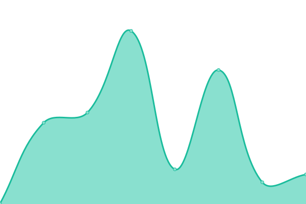
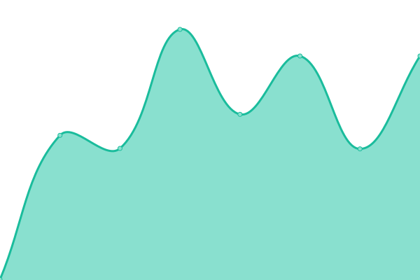
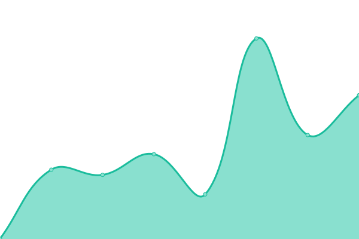
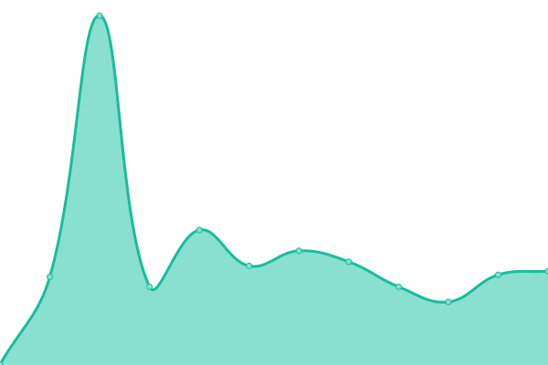
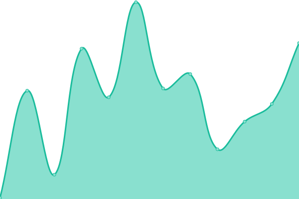

# [📈 Live Status](https://backbonecabal.github.io/service-status): <!--live status--> **🟧 Partial outage**

This repository contains the open-source uptime monitor and status page for [backbonecabal](backbonecabal.com), powered by [Upptime](https://github.com/upptime/upptime).

With [Upptime](https://upptime.js.org), you can get your own unlimited and free uptime monitor and status page, powered entirely by a GitHub repository. We use [Issues](https://github.com/backbonecabal/service-status/issues) as incident reports, [Actions](https://github.com/backbonecabal/service-status/actions) as uptime monitors, and [Pages](https://backbonecabal.github.io/service-status) for the status page.

<!--start: status pages-->
<!-- This summary is generated by Upptime (https://github.com/upptime/upptime) -->
<!-- Do not edit this manually, your changes will be overwritten -->
<!-- prettier-ignore -->
| URL | Status | History | Response Time | Uptime |
| --- | ------ | ------- | ------------- | ------ |
|  [Manifold Finance](https://manifoldfinance.com) | 🟩 Up | [manifold-finance.yml](https://github.com/backbonecabal/service-status/commits/HEAD/history/manifold-finance.yml) | 

 271ms
     
 | 

<a href="https://backbonecabal.github.io/service-status/history/manifold-finance">100.00%</a>
    

|  [SushiSwap Exchange](https://sushiswap.fi) | 🟩 Up | [sushi-swap-exchange.yml](https://github.com/backbonecabal/service-status/commits/HEAD/history/sushi-swap-exchange.yml) | 

 347ms
     
 | 

<a href="https://backbonecabal.github.io/service-status/history/sushi-swap-exchange">100.00%</a>
    

|  [SushiSwap GraphQL Endpoint](https://github.com/sushiswap/sushiswap-subgraph) | 🟩 Up | [sushi-swap-graph-ql-endpoint.yml](https://github.com/backbonecabal/service-status/commits/HEAD/history/sushi-swap-graph-ql-endpoint.yml) | 

 510ms
     
 | 

<a href="https://backbonecabal.github.io/service-status/history/sushi-swap-graph-ql-endpoint">100.00%</a>
    

|  [Sushi Bar](https://api.thegraph.com/subgraphs/name/sushiswap/sushi-bar) | 🟥 Down | [sushi-bar.yml](https://github.com/backbonecabal/service-status/commits/HEAD/history/sushi-bar.yml) | 

 206ms
     
 | 

<a href="https://backbonecabal.github.io/service-status/history/sushi-bar">100.00%</a>
    

|  [SushiSwap Factory](https://api.thegraph.com/subgraphs/name/zippoxer/sushiswap-subgraph-fork) | 🟩 Up | [sushi-swap-factory.yml](https://github.com/backbonecabal/service-status/commits/HEAD/history/sushi-swap-factory.yml) | 

 138ms
     
 | 

<a href="https://backbonecabal.github.io/service-status/history/sushi-swap-factory">100.00%</a>
    

|  [SushiSwapV2](https://api.thegraph.com/subgraphs/name/sushiswap/sushiswap) | 🟥 Down | [sushi-swap-v2.yml](https://github.com/backbonecabal/service-status/commits/HEAD/history/sushi-swap-v2.yml) | 

 130ms
     
 | 

<a href="https://backbonecabal.github.io/service-status/history/sushi-swap-v2">100.00%</a>
    

<!--end: status pages-->

[**Visit our status website →**](https://backbonecabal.github.io/service-status)

## 📄 License

- Powered by: [Upptime](https://github.com/upptime/upptime)
- Code: [MIT](./LICENSE) © [backbonecabal](backbonecabal.com)
- Data in the `./history` directory: [Open Database License](https://opendatacommons.org/licenses/odbl/1-0/)
